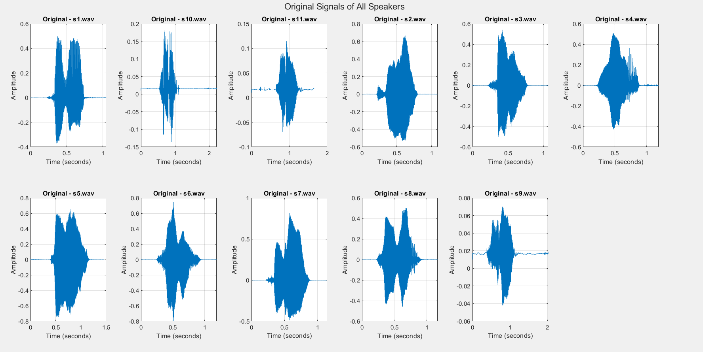
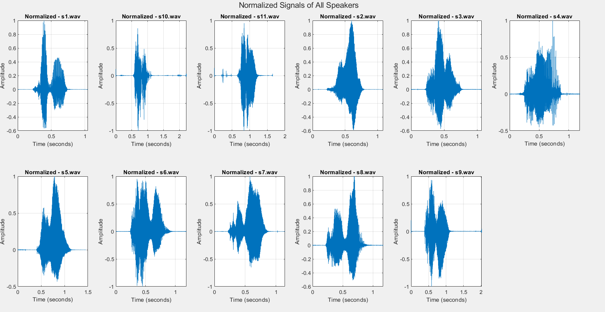
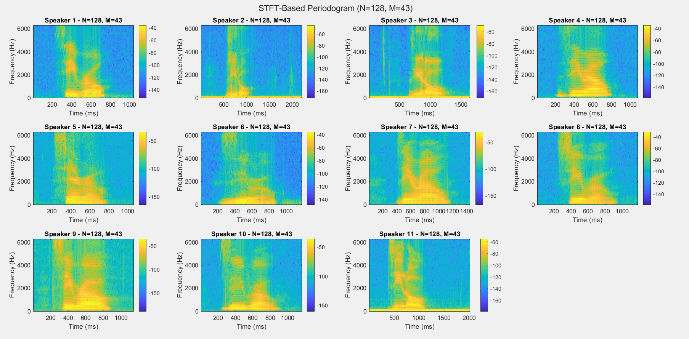
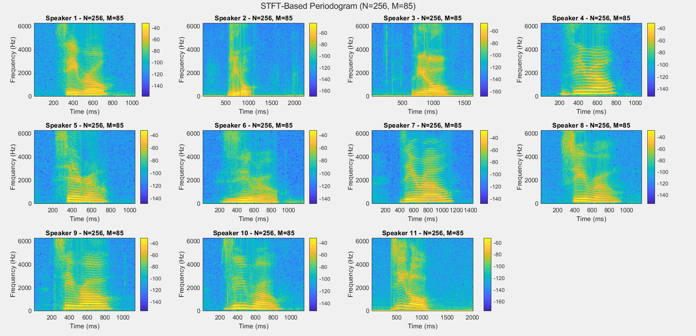
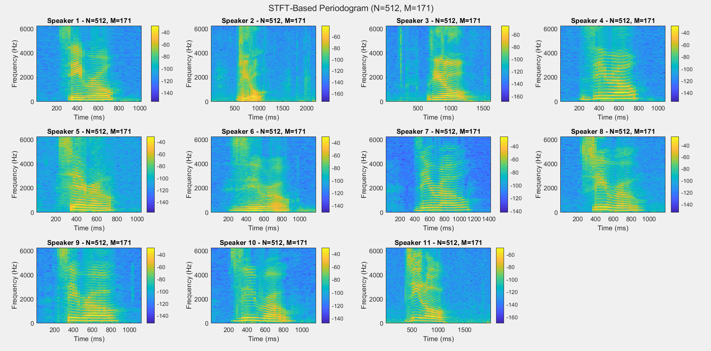
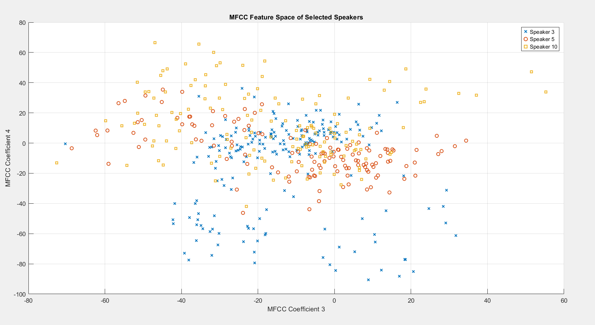
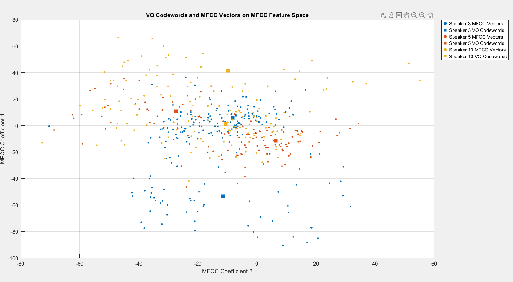
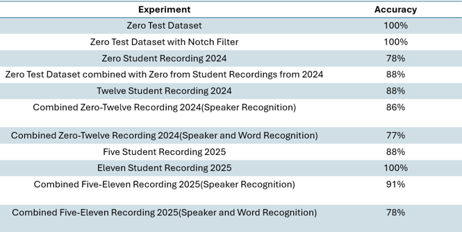
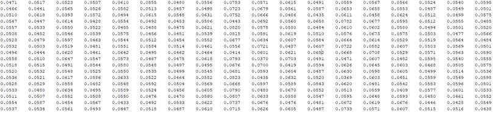
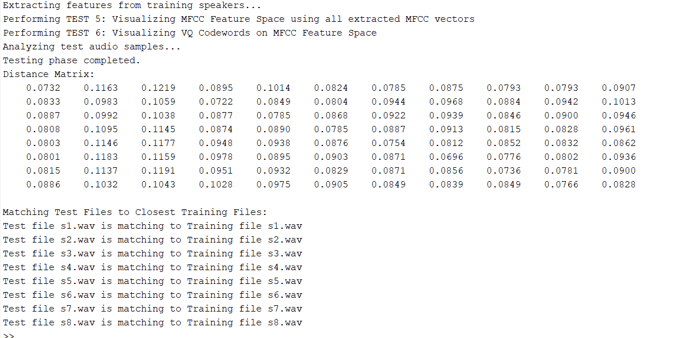

# DSP Winter 2025 Project

## **Speaker Recognition using Digital Signal Processing**
Students: Shashank M, Sahishnu Raju Kakarlapudi

Team Name: Vocalists 

# Speaker Recognition using DSP in MATLAB

## Project Overview
This speech recognition system extracts key features using MFCCs and analyzes time-frequency patterns with STFT. Pre-emphasis filtering enhances high frequencies, while windowing reduces spectral leakage. Vector quantization (VQ) with the LBG algorithm clusters feature vectors to build speaker models. The system optimizes recognition by balancing time-frequency resolution and leveraging MFCC-based feature extraction for robust performance.

## Instructions to Run the Code

### MATLAB Files & Their Functions
This project consists of **7 MATLAB scripts**, each performing speech recognition on different training and testing datasets. Just download and run script per choice (All necessary Functions are present in all the matlab scripts).

---

### 1. Main Script: `Script_TestData_Zeros_WithPlots.m`
- **Purpose:** Trains and tests on the **calibration "zero" word dataset** found in the `data` folder.
- **Data Used:**
  - **Training Data:** `Train_our`
  - **Testing Data:** `Test_our`
- **Functionality:** This script **plots and visualizes** different audio characteristics of the dataset.

#### Steps to Run:
1. **Modify Data Paths:**
   - Update **line 5 and line 6** to reflect the correct paths to your dataset.
2. **Set Speaker Count:**
   - Update **line 11 and line 12** with the correct number of speakers for training and testing.
   - If you want to use your own dataset, update these lines accordingly.

---

### 2. `Script_Notch_ZeroTestData.m`
- **Purpose:**  
  - Applies **Notch filtering** to suppress certain features in the calibration dataset.
  - Checks for the robustness of speech recognition after filtering.
- **Data Used:**
  - **Training Data:** `Train_our`
  - **Testing Data:** `Test_our`

---

### 3. `Script_Five_Twelve_SingleData.m`
- **Purpose:**  
  - Checks for **speaker recognition** using the words "Five" and "Twelve," which are trained and tested separately.
- **Data Used:**
  - **Training Data:** `Five-Training`, `Twelve-Training`
  - **Testing Data:** `Five-Test`, `Twelve-Testing`

---

### 4. `Script_Eleven_SingleData.m`
- **Purpose:**  
  - Checks for **speaker recognition** using the word "Eleven," which are trained and tested separately.
- **Data Used:**
  - **Training Data:**  `Eleven-Training`
  - **Testing Data:**  `Eleven-Test`

---

### 5. `Script_TestZero_ZeroCombData.m`
- **Purpose:**  
  - Tests are conducted where the **speech files of "Zero" are placed in one folder, trained together, and tested** to check:
    1. If the system correctly matches the speech files to the **right person**.
    2. If the system correctly identifies the **right word spoken by the right person**.
- **Data Used:**
  - **Training Data:** `ZeroComb-Train`
  - **Testing Data:** `ZeroComb-Test`

---

### 6. `Script_Zero_Twelve_CombData.m`
- **Purpose:**  
  - Tests are conducted where the **speech files of both "Zero" and "Twelve" are placed in one folder, trained together, and tested** to check:
    1. If the system correctly matches the speech files to the **right person**.
    2. If the system correctly identifies the **right word spoken by the right person**.
- **Data Used:**
  - **Training Data:** `ZeroTwelveComb-Train`
  - **Testing Data:** `ZeroTwelveComb-Test`

---

### 7. `Script_FiveElevenCombinedData.m`
- **Purpose:**  
  - Tests are conducted where the **speech files of both "Five" and "Eleven" are placed in one folder, trained together, and tested** to check:
    1. If the system correctly matches the speech files to the **right person**.
    2. If the system correctly identifies the **right word spoken by the right person**.
- **Data Used:**
  - **Training Data:** `FiveElevenComb-Train`
  - **Testing Data:** `FiveElevenComb-Test`

---

### Feel free to add your own voice samples to the data set and test for recognition 😊

## **1. Introduction**
Speaker recognition is an essential application of digital signal processing (DSP) that enables the identification of individuals based on their speech characteristics. This project implements a speaker recognition system using Mel Frequency Cepstral Coefficients (MFCC) and vector quantization techniques. The goal is to extract and compare unique voice features for accurate speaker identification. By leveraging signal processing techniques, we aim to create a system capable of recognizing speakers based on their speech patterns, even with variations in volume, background noise, and pronunciation.

Figure 1. Basic structures of speaker identification systems - ref.1

## **2. Problem Statement**
The primary objective of this project is to develop an efficient and robust speaker recognition system that can distinguish between different speakers based on their vocal characteristics. One of the key challenges in speaker recognition is ensuring that extracted speech features are distinct enough to enable accurate classification. Factors such as noise, pitch variations, and recording quality can influence recognition performance. 

In this preliminary phase, the system is tested on a dataset where speakers utter the word "zero." The results for this specific test case will be discussed in this report, while additional test cases will be included in the final submission.

## **3. Approach and Methodology**
The speaker recognition system follows a structured pipeline involving preprocessing, feature extraction, and classification.

### **3.1 Dataset and Preprocessing**
The dataset consists of recorded speech samples from multiple speakers, divided into training and test sets. The training set consists of speech recordings from 11 speakers, while the test set contains 8 speech samples.

To prepare the audio data for feature extraction, several preprocessing steps are applied:
- **Pre-Emphasis Filtering:** A high-pass filter is applied to the speech signal to amplify high-frequency components, improving the robustness of extracted features.
- **Framing and Windowing:** The speech signal is divided into overlapping frames to ensure a smooth spectral transition and maintain time-domain characteristics.
- **Short-Time Fourier Transform (STFT):** STFT is used to convert the time-domain signal into a frequency-domain representation, which provides a better understanding of the speech signal's spectral properties.
  
 

Figure 2. Block diagram of the MFCC processor - ref.2

### **3.2 Feature Extraction using MFCC**
Feature extraction is a crucial step in speaker recognition, as it helps to isolate speaker-specific characteristics. The system extracts MFCCs from the speech signals because they closely mimic human auditory perception and are widely used in speech and speaker recognition tasks. 

The key steps in MFCC extraction include:
Computing the **power spectrum** of the speech signal.
Applying a **Mel filter bank** to focus on frequency ranges most relevant to human speech perception.
Applying a **logarithmic transformation** to enhance weaker speech features and normalize differences in intensity.
Using the **Discrete Cosine Transform (DCT)** to decorrelate features and concentrate energy into a smaller set of coefficients.

These MFCC features serve as the primary input for speaker recognition and classification.

 

Figure 3. An example of mel-spaced filter bank - ref.3

### **3.3 Speaker Codebook Generation with Vector Quantization**
Once MFCC features are extracted, the system applies vector quantization to generate a speaker-specific codebook. This process involves:
**Clustering MFCC features** using an iterative approach to identify representative centroids for each speaker.
**Measuring similarity** between extracted features and stored codebooks using **Euclidean distance**.
**Assigning test samples** to the speaker whose codebook yields the lowest distance, indicating the closest match.

Vector qantization reduces the complexity of classification by representing each speaker's unique feature set with a limited number of representative points.

Figure 4. Conceptual diagram illustrating vector quantization codebook formation - ref.4

## **4. Code Overview**
The speaker recognition system is implemented in MATLAB and follows a structured workflow:

First, the system loads audio files from the training and test datasets, applies pre-emphasis filtering, and extracts spectral features using STFT. The power spectrum of each speech signal is then used to compute MFCC features, which are normalized to ensure consistency across different recordings.

In the training phase, MFCC features are clustered using vector quntization, and a codebook is generated for each speaker. This codebook serves as a reference for matching test samples.

During testing, tthe system extracts MFCC features from the test speech samples and compares them against stored speaker codebooks using Euclidean distance. The speaker with the smallest distance is identified as the most probable match.

The final output of the system displays the predicted speaker for each test sample and computes the overall recognition accuracy.

Figure 5. Flow diagram of LBG algorithm - ref.5

# Algorithm Development & Testing

Our algorithm was refined through a series of structured tests, each focusing on a crucial step in the speech processing pipeline. Below is a detailed breakdown of the development process and findings from each test.

## TEST 1: Human Recognition of Speech
Before building an automated speech recognition system, we tested our ability to recognize different speakers manually. We listened to training audio samples and attempted to match them to their respective speakers. Next, we played test files in a random order and tried to identify the speaker based on our perception.

After performing this exercise, we achieved an accuracy of 34%, demonstrating the difficulty of speaker recognition through human perception alone. This provided a baseline for evaluating the performance of our automated system.

## TEST 2: Time-Domain Representation & Spectral Analysis
Speech signals vary significantly in amplitude and duration, making preprocessing and visualization important for understanding their structure. In this test, we examined the raw waveform of speech and analyzed its spectral characteristics.

To begin, we loaded and plotted each speech signal in the time domain, revealing how different speakers exhibit varying amplitudes and speech durations. Since these variations can affect feature extraction, we normalized the signals to ensure consistent processing. The signals were then transformed into the frequency domain using STFT (Short-Time Fourier Transform) to generate a periodogram, which displays how speech energy is distributed across time and frequency.

### From our observations:
- Raw speech signals exhibited large variations in amplitude and duration.
- STFT periodograms revealed dominant frequency components in different speech samples, indicating that important speech features are concentrated in certain frequency bands.

Figures below are Time-Domain Waveform and normalised signal waveforms

Figures below are STFT Periodogram plots different Frame and Overlap sizes

## STFT Periodogram Analysis: Effect of Frame Size (N) and Overlap (M)

### Observations on Different Frame Sizes (N)

When analyzing STFT periodograms with different frame sizes (N) and overlap sizes (M), we observe a clear trade-off between time and frequency resolution:

- **Small N (e.g., 128):**  
  - Provides better time resolution, capturing sharp vertical transitions effectively.
  - Results in poor frequency resolution, making horizontal bands appear blurry.
  - Useful for detecting transient sounds, such as plosives in speech.

- **Medium N (e.g., 512):**  
  - Offers a balanced trade-off between time and frequency resolution.
  - Suitable for general speech analysis, where both time structure and frequency details are important.

- **Large N (e.g., 1024):**  
  - Improves frequency resolution, producing sharp horizontal bands and enhancing the clarity of stable sounds like vowels.
  - Comes at the cost of time resolution, leading to smoothed transitions.
  - Useful for analyzing sustained speech components like vowels.

### Choosing the Right N
The choice of N depends on the specific aspects of speech being analyzed:
- Smaller values of N favor **time precision**, making them ideal for transient speech sounds.
- Larger values of N enhance **spectral clarity**, making them more effective for analyzing steady-state sounds.

This trade-off highlights the importance of selecting an appropriate N depending on the requirements of speech feature extraction and recognition tasks.

## TEST 3: Mel-Spaced Filter Bank Response
One of the fundamental transformations in speech processing is the Mel scale conversion, which helps model human auditory perception. The goal of this test was to apply Mel-spaced filter banks to speech signals and analyze their effect.

To achieve this, we designed 40 Mel filters and applied them to the frequency spectrum of the speech signals. The responses of the filters were then plotted to verify that they followed the expected triangular shape.

### Key findings:
- The Mel filter bank response showed compression of higher frequencies, aligning with how humans perceive sound.
- The speech spectrogram before and after Mel filtering demonstrated how the transformation effectively emphasizes speech-relevant frequency components while reducing less useful information.

Figure. Mel Filter Bank Response and Before/After Filtering Spectrogram Images

## TEST 4: Cepstrum Analysis
Extracting Cepstral features is a crucial step in speech recognition, as it helps distinguish different speakers' vocal characteristics. In this test, we computed MFCCs (Mel-Frequency Cepstral Coefficients) and analyzed the Cepstrum representation of the speech signals.

### Steps involved:
1. **Apply Discrete Cosine Transform (DCT):** This compresses spectral information, keeping only the most relevant coefficients.
2. **Remove redundant frequency variations:** By focusing on the lower-order coefficients, we eliminate unnecessary frequency information.
3. **Extract MFCCs:** The first few MFCCs capture essential speech features, making them useful for recognition.

### Our analysis showed that:
- MFCC features retained key speaker characteristics while reducing noise and irrelevant variations.
- Cepstrum representation provided a more compact and effective way to differentiate between different speakers.

## TEST 5: Visualizing Acoustic Space (MFCC Clusters)
To verify the effectiveness of our extracted MFCC features, we examined how well they form distinct clusters for different speakers. If MFCCs work correctly, the feature vectors for each speaker should be grouped closely together, making it easier to distinguish between different individuals.

We extracted MFCC feature vectors from multiple speakers and plotted the second and third MFCC coefficients against each other. Each speaker’s features were color-coded for easy differentiation.

### Observations:
- Distinct clusters were formed for different speakers, confirming that MFCCs effectively capture speaker characteristics.
- While some overlap existed, many features remained well-separated, proving that our approach is useful for speaker differentiation.

Figure. MFCC Feature Space Scatter Plot

## TEST 6: Vector Quantization (VQ) Codewords
The final step in our recognition pipeline was Vector Quantization (VQ), which compresses the MFCC feature space while preserving key information. This step ensures that speaker models remain compact and efficient.

We trained a VQ Codebook using the Linde-Buzo-Gray (LBG) algorithm and overlaid the quantized codewords onto the previously plotted MFCC feature vectors.

### Results & Observations:
- The VQ codewords closely followed the MFCC clusters, confirming that they effectively represent the speaker’s speech patterns.
- By comparing the codewords to the original MFCC feature vectors, we observed that VQ provides an efficient representation without losing critical speaker identity.

Figure for VQ Codewords Over MFCC Clusters Plot

## Conclusion
This project successfully implemented a speech recognition system using MFCC feature extraction and Vector Quantization. The step-by-step evaluations confirmed the effectiveness of each DSP technique in transforming speech into a meaningful representation for recognition.

### Key Takeaways:
- **MFCCs** provide a robust feature set for distinguishing speakers.
- **Mel filtering** improves feature representation, ensuring that speech-relevant frequencies are prioritized.
- **Cepstrum analysis** effectively reduces redundant spectral information, making classification easier.
- **Vector Quantization** optimizes memory usage while retaining the necessary features for recognition.

Our system demonstrates a well-structured speech processing pipeline, forming the foundation for speaker identification and speech recognition applications.

## **5. Results and Analysis**

The table above summarizes the accuracy results obtained from various speech recognition experiments conducted in this project.

The Zero Test Dataset achieved 100% accuracy, indicating that the system correctly recognized all test samples. The Notch Filter applied to the same dataset maintained this accuracy, suggesting that the filter did not negatively impact recognition.

Student recordings from 2024 showed a decrease in accuracy (78% for "Zero" and 88% for "Twelve"), likely due to variations in pronunciation and recording conditions. However, when the Zero Test Dataset was combined with "Zero" from the student recordings, accuracy improved to 88%, indicating that a larger and more diverse dataset helped improve recognition.

In combined datasets, where different words spoken by the same speaker were trained together, accuracy varied. The Zero-Twelve combined dataset for speaker recognition achieved 86%, but when testing both speaker and word recognition, accuracy dropped to 77%, reflecting the added complexity of distinguishing words as well as speakers.

For 2025 recordings, "Five" and "Eleven" were tested separately, achieving 88% and 100% accuracy, respectively. When the Five-Eleven dataset was combined for speaker recognition, accuracy remained high at 91%, but when word recognition was added, it dropped to 78%, similar to the Zero-Twelve dataset results.

## **6. Conclusion and Future Work**
This preliminary implementation successfully demonstrates a speaker recognition system using MFCC and vector quantization, achieving 100% accuracy on the test case. The results confirm that MFCC-based feature extraction is highly effective for distinguishing speakers, while vector quantization provides a compact and efficient representation of speech features.

Moving forward, additional test cases will be included to evaluate the system's performance under varied conditions. Future enhancements may involve:
Expanding the dataset to include different spoken words and sentences.
Evaluating the system’s performance in noisy environments.
Exploring deep learning-based speaker embeddings for improved accuracy and scalability.
Implementing real-time speaker recognition applications for practical deployment.

## **7. Example Output**

## **8. Refrences**
Fazel, A., & Chakrabartty, S. (2011). An Overview of Statistical Pattern Recognition Techniques for Speaker Verification. *IEEE Circuits and Systems Magazine, 11*(2), 62-81. https://doi.org/10.1109/MCAS.2011.941080

Abdouni, A., Vargiolu, R., & Zahouani, H. (2018). Impact of finger biophysical properties on touch gestures and tactile perception: Aging and gender effects. *Scientific Reports.* https://doi.org/10.1038/s41598-018-30677-2

Mohd Ali, Y., Paulraj, M. P., Yaacob, S., Yusuf, R., & Abu Bakar, S. (2013). Analysis of Accent-Sensitive Words in Multi-Resolution Mel-Frequency Cepstral Coefficients for Classification of Accents in Malaysian English. *International Journal of Automotive and Mechanical Engineering, 7*, 1053-1073. https://doi.org/10.15282/ijame.7.2012.21.0086

Casil, R., Dimaunahan, E., Manamparan, M., Nia, B., & Beltran Jr, A. (2014). A DSP Based Vector Quantized Mel Frequency Cepstrum Coefficients for Speech Recognition. *Institute of Electronics Engineers of the Philippines (IECEP) Journal, 3*, 1-5.

Lafta, H., & Al-Sultan, A. (2015). Mel Frequency Cepstrum Coefficients and Enhanced LBG Algorithm for Speaker Recognition. *Researcher, 7*, 19-25. Retrieved from http://www.sciencepub.net/researcher

