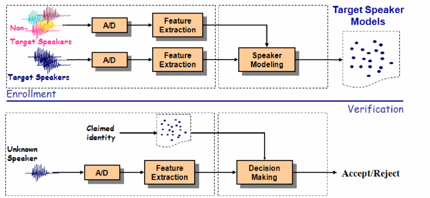
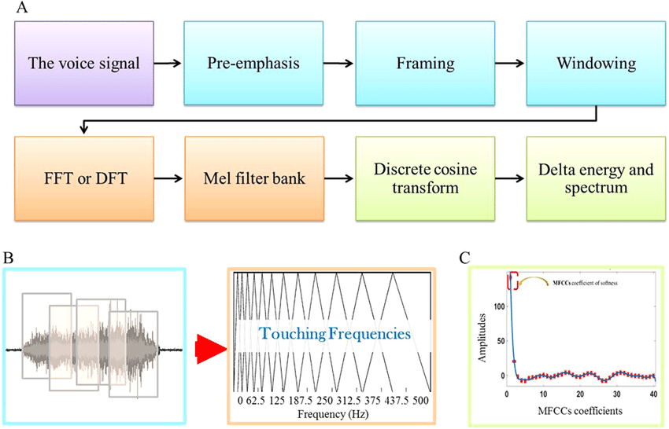
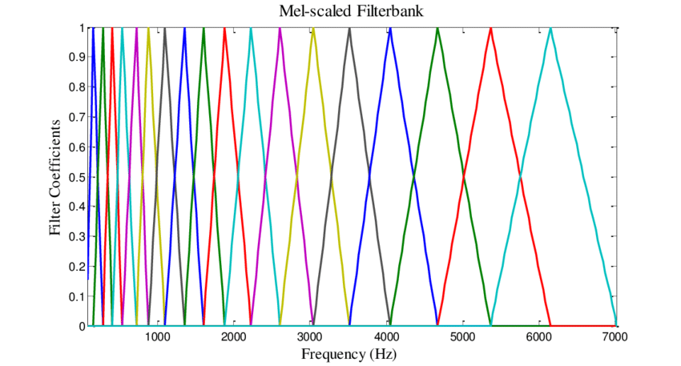
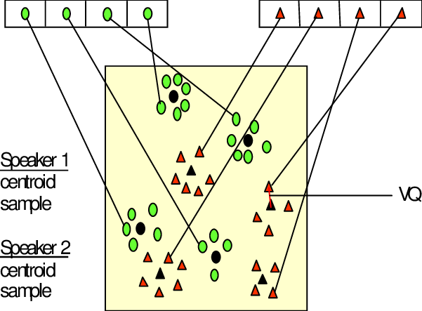
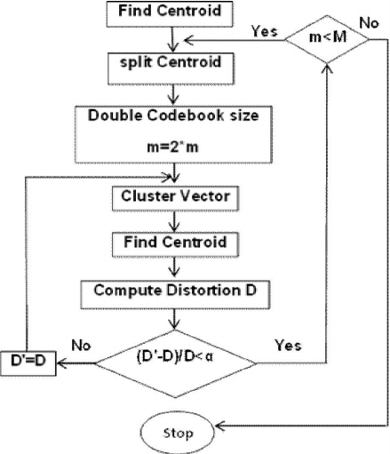

# DSP Winter 2025 Project

## **Speaker Recognition using Digital Signal Processing**
Students: Shashank M, Sahishnu Raju Kakarlapudi

Team Name: Vocalists 

# Speaker Recognition using DSP in MATLAB

## Project Overview
This speech recognition system extracts key features using MFCCs and analyzes time-frequency patterns with STFT. Pre-emphasis filtering enhances high frequencies, while windowing reduces spectral leakage. Vector quantization (VQ) with the LBG algorithm clusters feature vectors to build speaker models. The system optimizes recognition by balancing time-frequency resolution and leveraging MFCC-based feature extraction for robust performance.

## Instructions to Run the Code

### MATLAB Files & Their Functions
This project consists of **7 MATLAB scripts**, each performing speech recognition on different training and testing datasets. Just download and run script per choice (All necessary Functions are present in all the matlab scripts).

---

### 1. Main Script: `Script_TestData_Zeros_WithPlots.m`
- **Purpose:** Trains and tests on the **calibration "zero" word dataset** found in the `data` folder.
- **Data Used:**
  - **Training Data:** `Train_our`
  - **Testing Data:** `Test_our`
- **Functionality:** This script **plots and visualizes** different audio characteristics of the dataset.

#### Steps to Run:
1. **Modify Data Paths:**
   - Update **line 5 and line 6** to reflect the correct paths to your dataset.
2. **Set Speaker Count:**
   - Update **line 11 and line 12** with the correct number of speakers for training and testing.
   - If you want to use your own dataset, update these lines accordingly.

---

### 2. `Script_Notch_ZeroTestData.m`
- **Purpose:**  
  - Applies **Notch filtering** to suppress certain features in the calibration dataset.
  - Checks for the robustness of speech recognition after filtering.
- **Data Used:**
  - **Training Data:** `Train_our`
  - **Testing Data:** `Test_our`

---

### 3. `Script_Five_Twelve_SingleData.m`
- **Purpose:**  
  - Checks for **speaker recognition** using the words "Five" and "Twelve," which are trained and tested separately.
- **Data Used:**
  - **Training Data:** `Five-Training`, `Twelve-Training`
  - **Testing Data:** `Five-Test`, `Twelve-Testing`

---

### 4. `Script_TestZero_Eleven_SingleData.m`
- **Purpose:**  
  - Checks for **speaker recognition** using the words "Zero" and "Eleven," which are trained and tested separately.
- **Data Used:**
  - **Training Data:** `Zero-Training`, `Eleven-Training`
  - **Testing Data:** `Zero-Testing`, `Eleven-Test`

---

### 5. `Script_TestZero_ZeroCombData.m`
- **Purpose:**  
  - Tests are conducted where the **speech files of "Zero" are placed in one folder, trained together, and tested** to check:
    1. If the system correctly matches the speech files to the **right person**.
    2. If the system correctly identifies the **right word spoken by the right person**.
- **Data Used:**
  - **Training Data:** `ZeroComb-Train`
  - **Testing Data:** `ZeroComb-Test`

---

### 6. `Script_Zero_Twelve_CombData.m`
- **Purpose:**  
  - Tests are conducted where the **speech files of both "Zero" and "Twelve" are placed in one folder, trained together, and tested** to check:
    1. If the system correctly matches the speech files to the **right person**.
    2. If the system correctly identifies the **right word spoken by the right person**.
- **Data Used:**
  - **Training Data:** `ZeroTwelveComb-Train`
  - **Testing Data:** `ZeroTwelveComb-Test`

---

### 7. `Script_FiveElevenCombinedData.m`
- **Purpose:**  
  - Tests are conducted where the **speech files of both "Five" and "Eleven" are placed in one folder, trained together, and tested** to check:
    1. If the system correctly matches the speech files to the **right person**.
    2. If the system correctly identifies the **right word spoken by the right person**.
- **Data Used:**
  - **Training Data:** `FiveElevenComb-Train`
  - **Testing Data:** `FiveElevenComb-Test`

---

### Feel free to add your own voice samples to the data set and test for recognition 😊

## **1. Introduction**
Speaker recognition is an essential application of digital signal processing (DSP) that enables the identification of individuals based on their speech characteristics. This project implements a speaker recognition system using Mel Frequency Cepstral Coefficients (MFCC) and vector quantization techniques. The goal is to extract and compare unique voice features for accurate speaker identification. By leveraging signal processing techniques, we aim to create a system capable of recognizing speakers based on their speech patterns, even with variations in volume, background noise, and pronunciation.

Figure 1. Basic structures of speaker identification systems - ref.1

## **2. Problem Statement**
The primary objective of this project is to develop an efficient and robust speaker recognition system that can distinguish between different speakers based on their vocal characteristics. One of the key challenges in speaker recognition is ensuring that extracted speech features are distinct enough to enable accurate classification. Factors such as noise, pitch variations, and recording quality can influence recognition performance. 

In this preliminary phase, the system is tested on a dataset where speakers utter the word "zero." The results for this specific test case will be discussed in this report, while additional test cases will be included in the final submission.

## **3. Approach and Methodology**
The speaker recognition system follows a structured pipeline involving preprocessing, feature extraction, and classification.

### **3.1 Dataset and Preprocessing**
The dataset consists of recorded speech samples from multiple speakers, divided into training and test sets. The training set consists of speech recordings from 11 speakers, while the test set contains 8 speech samples.

To prepare the audio data for feature extraction, several preprocessing steps are applied:
- **Pre-Emphasis Filtering:** A high-pass filter is applied to the speech signal to amplify high-frequency components, improving the robustness of extracted features.
- **Framing and Windowing:** The speech signal is divided into overlapping frames to ensure a smooth spectral transition and maintain time-domain characteristics.
- **Short-Time Fourier Transform (STFT):** STFT is used to convert the time-domain signal into a frequency-domain representation, which provides a better understanding of the speech signal's spectral properties.
  
 

Figure 2. Block diagram of the MFCC processor - ref.2

### **3.2 Feature Extraction using MFCC**
Feature extraction is a crucial step in speaker recognition, as it helps to isolate speaker-specific characteristics. The system extracts MFCCs from the speech signals because they closely mimic human auditory perception and are widely used in speech and speaker recognition tasks. 

The key steps in MFCC extraction include:
Computing the **power spectrum** of the speech signal.
Applying a **Mel filter bank** to focus on frequency ranges most relevant to human speech perception.
Applying a **logarithmic transformation** to enhance weaker speech features and normalize differences in intensity.
Using the **Discrete Cosine Transform (DCT)** to decorrelate features and concentrate energy into a smaller set of coefficients.

These MFCC features serve as the primary input for speaker recognition and classification.

 

Figure 3. An example of mel-spaced filter bank - ref.3

### **3.3 Speaker Codebook Generation with Vector Quantization**
Once MFCC features are extracted, the system applies vector quantization to generate a speaker-specific codebook. This process involves:
**Clustering MFCC features** using an iterative approach to identify representative centroids for each speaker.
**Measuring similarity** between extracted features and stored codebooks using **Euclidean distance**.
**Assigning test samples** to the speaker whose codebook yields the lowest distance, indicating the closest match.

Vector qantization reduces the complexity of classification by representing each speaker's unique feature set with a limited number of representative points.

Figure 4. Conceptual diagram illustrating vector quantization codebook formation - ref.4

## **4. Code Overview**
The speaker recognition system is implemented in MATLAB and follows a structured workflow:

First, the system loads audio files from the training and test datasets, applies pre-emphasis filtering, and extracts spectral features using STFT. The power spectrum of each speech signal is then used to compute MFCC features, which are normalized to ensure consistency across different recordings.

In the training phase, MFCC features are clustered using vector quntization, and a codebook is generated for each speaker. This codebook serves as a reference for matching test samples.

During testing, tthe system extracts MFCC features from the test speech samples and compares them against stored speaker codebooks using Euclidean distance. The speaker with the smallest distance is identified as the most probable match.

The final output of the system displays the predicted speaker for each test sample and computes the overall recognition accuracy.

Figure 5. Flow diagram of LBG algorithm - ref.5

## **5. Results and Analysis**
In this preliminary evaluation, the system was tested on a dataset where speakers pronounced the word "zero." The system achieved **100% recognition accuracy** for this specific test case. 

The results highlight the effectiveness of MFCC-based feature extraction and vector quantization for speaker recognition. The use of logarithmic scaling and DCT in the MFCC computation very much improves feature separability, leading to precise speaker classification. Additionally, by leveraging vector quantization, the system efficiently clusters and matches features, further enhancing accuracy.

In comparison to direct FFT-based recognition, the use of MFCC provides a more nicer representation of speech characteristics. FFT alone fails to capture speaker-specific nuances, whereas MFCC effectively emphasizes key speech features, resulting in superior classification performance.

While the system has demonstrated high accuracy in this test case, aditional evaluations are required to assess its robustness against variations in speech content, background noise, and speaker emotion. Future tests will have more words and diverse speaker conditions to validate its effectiveness further.

## **6. Conclusion and Future Work**
This preliminary implementation successfully demonstrates a speaker recognition system using MFCC and vector quantization, achieving 100% accuracy on the test case. The results confirm that MFCC-based feature extraction is highly effective for distinguishing speakers, while vector quantization provides a compact and efficient representation of speech features.

Moving forward, additional test cases will be included to evaluate the system's performance under varied conditions. Future enhancements may involve:
Expanding the dataset to include different spoken words and sentences.
Evaluating the system’s performance in noisy environments.
Exploring deep learning-based speaker embeddings for improved accuracy and scalability.
Implementing real-time speaker recognition applications for practical deployment.

## **7. Refrences**
Fazel, A., & Chakrabartty, S. (2011). An Overview of Statistical Pattern Recognition Techniques for Speaker Verification. *IEEE Circuits and Systems Magazine, 11*(2), 62-81. https://doi.org/10.1109/MCAS.2011.941080

Abdouni, A., Vargiolu, R., & Zahouani, H. (2018). Impact of finger biophysical properties on touch gestures and tactile perception: Aging and gender effects. *Scientific Reports.* https://doi.org/10.1038/s41598-018-30677-2

Mohd Ali, Y., Paulraj, M. P., Yaacob, S., Yusuf, R., & Abu Bakar, S. (2013). Analysis of Accent-Sensitive Words in Multi-Resolution Mel-Frequency Cepstral Coefficients for Classification of Accents in Malaysian English. *International Journal of Automotive and Mechanical Engineering, 7*, 1053-1073. https://doi.org/10.15282/ijame.7.2012.21.0086

Casil, R., Dimaunahan, E., Manamparan, M., Nia, B., & Beltran Jr, A. (2014). A DSP Based Vector Quantized Mel Frequency Cepstrum Coefficients for Speech Recognition. *Institute of Electronics Engineers of the Philippines (IECEP) Journal, 3*, 1-5.

Lafta, H., & Al-Sultan, A. (2015). Mel Frequency Cepstrum Coefficients and Enhanced LBG Algorithm for Speaker Recognition. *Researcher, 7*, 19-25. Retrieved from http://www.sciencepub.net/researcher

